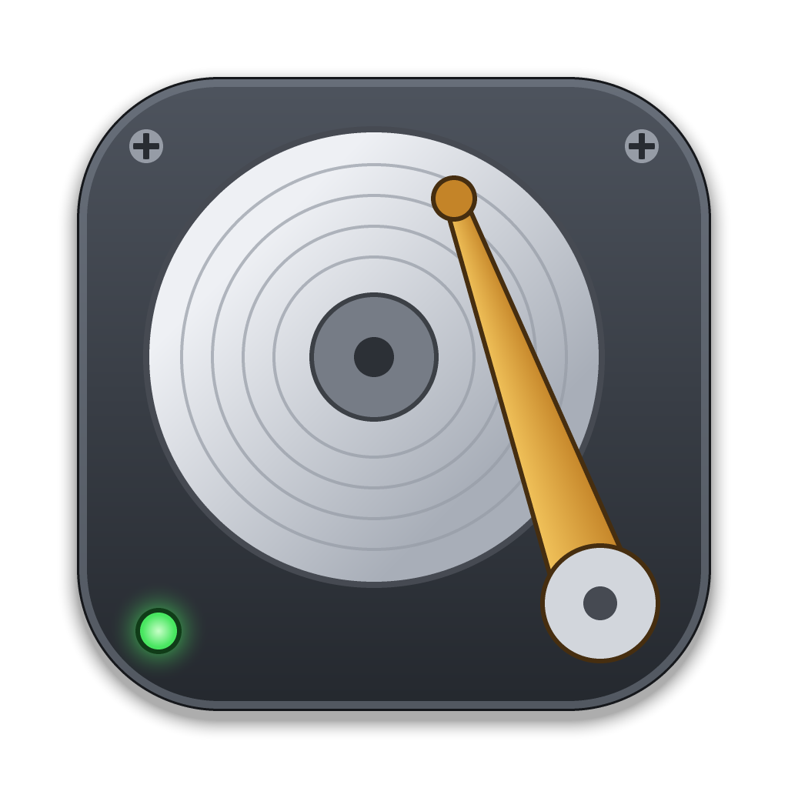

# 🎶 Mac Disk Sounds 💾



_Because your modern computer deserves to sound like it's from 1999_

[](https://github.com/khawkins98/mac-disk-sounds/releases)

## What is this madness? 🤔

Ever miss the satisfying sounds of a hard drive doing its thing? Feel like your fancy SSD is just too... quiet? Well, you're in luck! Mac Disk Sounds brings back that nostalgic whirring, clicking, and seeking of vintage hard drives to your modern computer.

## Features 🌟

- 🔊 Authentic retro HDD sound effects
- 🎚️ Adjustable volume controls
- 🎵 Background disk ambience option
- 🖥️ Classic Mac-style interface
- 💻 Lives in the menu bar / system tray and works in the background while you do actual work
- 💾 Remembers your settings, and can start at login
- 🤓 Perfect for confusing your coworkers
- 🎮 Hidden surprises for the curious (hint: some dots like to be clicked...)
- 🪟 Cross-platform: Linux is tested; disk activity detection on macOS and Windows is new and not yet tested on real machines. On Windows it reads the disk counters through PowerShell and CIM, which works in any display language; if that fails it falls back to `typeperf`, which needs English counter names
- 🏋️ Dozens or hundreds of MBs to download and make your SSD workout! Thanks Electron!

## Installation 🚀

### macOS

1. Download the latest `.dmg` from the releases page (or the `-mac.zip`, which holds the same app). There is one download for every Mac: it is a universal app that runs natively on both Apple silicon and Intel Macs (so the download is about twice the size of a single-architecture build).
2. Drag the app to your Applications folder
3. Open it and enjoy the sweet sounds of yesteryear!

#### The app is not signed

Mac Disk Sounds is **not signed or notarised** by Apple (that needs a $99 a year developer membership). macOS quarantines anything downloaded from the internet, and for an unsigned app it then refuses to open it, usually saying the app "is damaged and can't be opened" (it is not damaged). After dragging the app to your Applications folder, remove the quarantine flag in Terminal:

```bash
xattr -dr com.apple.quarantine "/Applications/Mac Disk Sounds.app"
```

Then open the app normally. You need to do this again after installing each new version. (`xattr -dr` removes the `com.apple.quarantine` attribute from the app and everything inside it; it changes nothing else.)

#### Updates

The app does not update itself. To see whether there is a newer version, choose **Check for Updates…** from its menu bar menu: it opens the [releases page](https://github.com/khawkins98/mac-disk-sounds/releases) on GitHub (newest first, pre-releases included), and the menu item above it shows the version you have. To update, quit the app, install the new version over the old one as above and run the `xattr` command again.

### Windows

1. Download the latest Windows installer (`.exe`) from the releases page
2. Run the installer (or use the portable version if you prefer)
3. Launch the app and pretend it's 1999 again!

### Linux

1. Download your preferred format:
   - `.AppImage`: Just make executable and run!
   - `.deb`: For Debian/Ubuntu-based systems
   - `.rpm`: For Red Hat/Fedora-based systems
2. Install using your package manager or run directly
3. Transport yourself back to the age of spinning platters!

## Using it 🖱️

Mac Disk Sounds runs from the menu bar (macOS) or the system tray (Windows and Linux); it has no Dock icon. The tray menu has:

- **Enabled**: turn the sounds on or off. Off stops the clicks, fades out the ambience and stops watching the disk.
- **Sound Set**: which recorded drive the clicks come from.
- **Open Settings…**: the System 7 window with the activity lights, the sound set and the click and ambience volumes.
- **Launch at Login** (installed builds only).
- The version you are running, and **Check for Updates…**, which opens the latest release on GitHub in your browser (the app does not update itself).
- **Quit**.

Clicking the icon opens the settings window, brings it to the front if other windows cover it, or closes it if it is already in front (on Linux most trays only show the menu, so use **Open Settings…**). Closing the window keeps the sounds going; only **Quit** stops the app. Starting the app by hand opens the settings window; starting at login does not. Settings are saved as `settings.json` in the app's user data folder. On Linux, Launch at Login writes `~/.config/autostart/mac-disk-sounds.desktop`.

On Linux the tray icon needs a StatusNotifierItem host (KDE, XFCE, Cinnamon, MATE and Ubuntu have one; stock GNOME needs the AppIndicator extension). If the app finds none at startup, the settings window says so and has a **Quit** button, and closing the window minimises it instead, so the app cannot end up running with no way back to it. Started at login with no tray, the app stays out of sight; start it again to show the window.

Power use on macOS: while the disk is busy and the sounds are enabled, the app holds a "prevent app suspension" power assertion so App Nap cannot delay the clicks; it is released as soon as the disk goes quiet or the sounds are turned off. A disk that is only touched now and then (say one small write every few seconds from some background service) counts as quiet: to keep clicking, the disk has to be busy for at least half of the last eight seconds. Separately, like any Chromium-based app, macOS is kept out of idle sleep while sound is actually playing, which includes the ambience. Set the ambience to 0 (or turn the sounds off) if you want your Mac to idle-sleep while the app runs; the display can sleep either way.

## Building from Source 🛠️

```bash
# Clone this repository
git clone https://github.com/khawkins98/mac-disk-sounds

# Navigate to the directory
cd mac-disk-sounds

# Install dependencies
npm install

# Start the app
npm start

# Run the tests and the linter
npm test
npm run lint

# Check the disk monitor works on this machine (about 5 seconds)
node scripts/smoke-monitor.mjs

# Redraw the tray icons in assets/tray/ (only after changing the script)
node scripts/make-tray-icons.mjs

# Redraw the app icon: build/icon.png, icon.icns and icon.ico
# (only after changing the script; the tests check they match it)
node scripts/make-app-icon.mjs

# Check the electron-builder config points at real files
node scripts/check-build-config.mjs

# Build for your platform
npm run build        # Builds for all platforms (macOS, Windows, Linux)
npm run build:mac    # Builds for macOS only
npm run build:win    # Builds for Windows only
npm run build:linux  # Builds for Linux only
```

### Project layout

```
src/main/        main process: app lifecycle and windows (index.js), tray,
                 settings, launch at login, disk monitor and activity model
src/preload.cjs  the bridge between the pages and main
src/renderer/    the settings window (index.html, renderer.js, styles.css),
                 the hidden audio window (audio.html, audio-host.js, audio.js)
                 and the vendored system.css
assets/sounds/   the sound files and their credits
assets/tray/     tray icons, drawn by scripts/make-tray-icons.mjs
build/           app icons used by electron-builder, drawn by
                 scripts/make-app-icon.mjs
scripts/         icon generators, the build config check and the disk
                 monitor smoke test
test/            node --test unit tests
```

## Publishing Releases 📦

When you want to create a new release, follow these steps:

- Update the version in your project's package.json file (e.g. 1.2.3)
- Commit that change (`git commit -am v1.2.3`)
- Tag your commit (`git tag v1.2.3`). Make sure your tag name's format is v*.*.\*.
  - Your workflow will use this tag to detect when to create a release
- Push your changes to GitHub (`git push && git push --tags`)

The release process will:

- Build packages for all platforms
- Create a GitHub release
- Upload all assets
- Tag the release with the version from package.json

The release workflow publishes with the repository's built-in `GITHUB_TOKEN`; no personal access token is needed.

## Why? 🤷‍♂️

Why not? Sometimes the best projects are the ones that make you smile. Plus, it's a great way to:

- Confuse your younger colleagues
- Pretend you're using a vintage computer
- Add some character to your silent machine
- Practice your "let me explain why my computer is making these sounds" speech
- Time travel back to the days of dial-up (maybe? 🤫)

## Seriously, Why? 🤷‍♂️

This project started as an experiment in two ways:

1. **Testing Cursor AI**: I was curious to see how helpful Cursor's AI assistant would be in building a complete application from scratch. The results were impressive - though I still needed to dive in with some key debugging, helping with image and sound files and guiding it towards things like [sakun/system.css](https://github.com/sakofchit/system.css).

2. **Missing Audio Feedback**: After switching to a fanless MacBook, I found myself missing the audio feedback that tells you when your computer is working hard. Modern computers are so quiet that you can't tell when they're under load.

## Credits 🙏

- IBM hard drive sounds from viertelnachvier on Pixabay
- Additional HDD sounds from martian on Pixabay
- [Dialup sound from wtermini on Pixabay](https://pixabay.com/sound-effects/the-sound-of-dial-up-internet-6240/)
- System 7 interface toolkit from [sakun/system.css](https://github.com/sakofchit/system.css) (MIT; v0.1.11 is bundled in `src/renderer/vendor/system.css/`)
- Built with Electron and too much free time
- Inspired by the golden age of spinning rust

## License 📜

MIT License - Feel free to make your computer sound as vintage as you want!

The sound files in `assets/sounds/` are **not** covered by the MIT licence. They are from Pixabay and used under the Pixabay Content License; see [assets/sounds/CREDITS.md](assets/sounds/CREDITS.md) for authors, sources and the ranges the app uses.

---

_Made with ❤️ and unnecessary disk activity_

P.S. Some say if you click things three times, magic happens... 🎵✨
